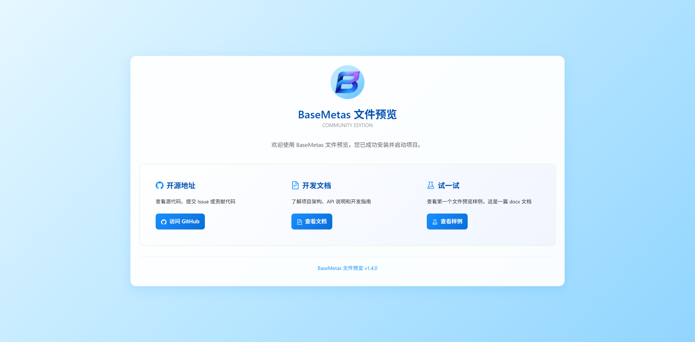

# BaseMetas Fileview

支持在线预览超过200种文件，API调用简单快捷，支持独立部署，开源免费。

- [官网链接](https://fileview.basemetas.cn/)


**运行服务**

```
docker run -d --name ateng-basemetas-fileview \
    -p 20045:80 --restart=always \
    -e TZ=Asia/Shanghai \
    basemetas/fileview:1.4.0
```

**查看日志**

```
docker logs -f ateng-basemetas-fileview
```

**使用服务**

访问 Web 服务

```
URL: http://192.168.1.12:20045
```



**删除服务**

停止服务

```
docker stop ateng-basemetas-fileview
```

删除服务

```
docker rm ateng-basemetas-fileview
```

