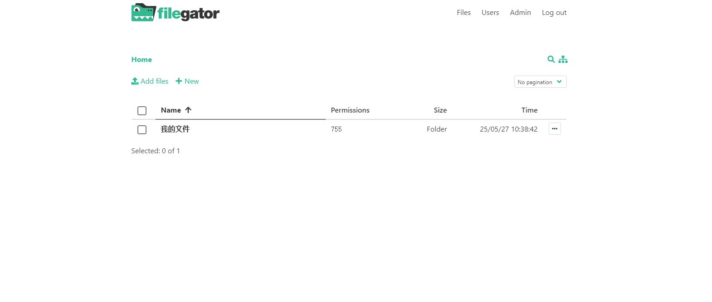

# FileGator

FileGator是一个免费的、开源的、自托管的web应用程序，用于管理文件和文件夹。

- [官网链接](https://github.com/filegator/filegator)


**下载镜像**

```
docker pull filegator/filegator:v7.13.0
```

**推送到仓库**

```
docker tag filegator/filegator:v7.13.0 registry.lingo.local/service/filegator:v7.13.0
docker push registry.lingo.local/service/filegator:v7.13.0
```

**保存镜像**

```
docker save registry.lingo.local/service/filegator:v7.13.0 | gzip -c > image-filegator_v7.13.0.tar.gz
```

**创建目录**

```
sudo mkdir -p /data/container/filegator
sudo chown 33:33 /data/container/filegator
```

**运行服务**

```
docker run -d --name ateng-filegator \
  -p 20031:8080 --restart=always \
  -v /data/container/filegator:/var/www/filegator/repository \
  registry.lingo.local/service/filegator:v7.13.0
```

**查看日志**

```
docker logs -f ateng-filegator
```

**使用服务**

```
URL: http://192.168.1.12:20031
Username: admin
Password: admin123
```



**删除服务**

停止服务

```
docker stop ateng-filegator
```

删除服务

```
docker rm ateng-filegator
```

删除目录

```
sudo rm -rf /data/container/filegator
```

