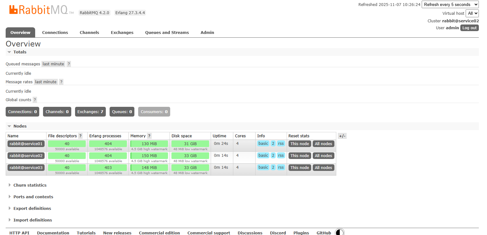

# RabbitMQ4

RabbitMQ 4 是新一代高可用消息中间件，基于 **Erlang/OTP** 构建，强调稳定性与分布式一致性。
 与 3.x 相比，4.x 引入 **Raft 元数据存储** 取代 Mnesia，实现更安全的集群同步机制。
 同时废弃部分旧特性（如 RAM 节点），强化 **Quorum 队列**、**Stream 队列** 等高可靠特性。
 支持 **多租户管理、自动发现、动态配置** 与 **高性能 CLI 工具**。
 整体更现代化、可观测性更强，适合云原生与企业级消息分发场景。

官网地址：[链接](https://www.rabbitmq.com/)

## 编译安装Erlang

**安装编译工具**

```
sudo dnf install -y openssl-devel gcc gcc-c++ perl-devel ncurses-devel
```

**下载并解压软件包**

```
wget https://github.com/erlang/otp/releases/download/OTP-27.3.4.4/otp_src_27.3.4.4.tar.gz
tar -zxvf otp_src_27.3.4.4.tar.gz
```

**编译安装软件包**

```
cd otp_src_27.3.4.4
./configure --prefix=/usr/local/software/erlang-27.3.4.4
make -j$(nproc)
make install
```

**设置软链接**

```
ln -s /usr/local/software/erlang-27.3.4.4 /usr/local/software/erlang
```

**设置全局访问**

```
sudo ln -s /usr/local/software/erlang/bin/erl /usr/bin/erl
sudo ln -s /usr/local/software/erlang/bin/escript /usr/bin/escript
```

**查看版本**

```
erl -version
```

输出

Erlang (SMP,ASYNC_THREADS) (BEAM) emulator version 15.2.7.3


## 安装和配置

### 安装

**下载软件包**

```
wget https://github.com/rabbitmq/rabbitmq-server/releases/download/v4.2.0/rabbitmq-server-generic-unix-4.2.0.tar.xz
```

**解压软件包**

```
tar -xvf rabbitmq-server-generic-unix-4.2.0.tar.xz -C /usr/local/software/
ln -s /usr/local/software/rabbitmq_server-4.2.0 /usr/local/software/rabbitmq
```

**配置环境变量**

```bash
cat >> ~/.bash_profile <<"EOF"
## RABBITMQ_HOME
export RABBITMQ_HOME=/usr/local/software/rabbitmq
export PATH=$PATH:$RABBIT_HOME/sbin
EOF
source ~/.bash_profile
```

**查看版本**

```
rabbitmqctl --version
```

输出

4.2.0

### 配置

**创建配置目录**

```
sudo mkdir -p /etc/rabbitmq
sudo chown -R admin:ateng /etc/rabbitmq
```

**创建数据目录**

```
sudo mkdir -p /data/service/rabbitmq/{data,log}
sudo chown -R admin:ateng /data/service/rabbitmq
```

**创建环境变量文件**

`NODENAME=rabbit@service01`：其中service01是主机名

```
cat > /etc/rabbitmq/rabbitmq-env.conf <<EOF
# 主目录
RABBITMQ_HOME=/usr/local/software/rabbitmq

# Erlang 节点名
RABBITMQ_NODENAME=rabbit@service01

# 数据目录（mnesia 存储）
RABBITMQ_MNESIA_BASE=/data/service/rabbitmq/data

# 日志目录
RABBITMQ_LOG_BASE=/data/service/rabbitmq/log

# PID 文件
RABBITMQ_PID_FILE=/data/service/rabbitmq/log/rabbitmq.pid

# 指定主配置文件路径
RABBITMQ_CONFIG_FILE=/etc/rabbitmq/rabbitmq.conf

# Erlang Cookie（用于集群通信）
RABBITMQ_ERLANG_COOKIE="Admin@123"
EOF
```

**创建系统配置文件**

```
cat > /etc/rabbitmq/rabbitmq.conf <<EOF
# 默认监听端口
listeners.tcp.default = 5672

# 管理端口
management.listener.port = 15672
management.listener.ssl = false

# 禁用 guest
loopback_users.guest = true

# 日志配置
log.file = rabbitmq.log
log.console = true
log.console.level = info

# 启用 Prometheus metrics（监控）
prometheus.tcp.port = 15692
EOF
```

**启用插件**

启用插件（Web管理、监控等）

```
rabbitmq-plugins enable rabbitmq_management rabbitmq_prometheus
```

**使用system管理服务**

```
sudo tee /etc/systemd/system/rabbitmq.service <<EOF
[Unit]
Description=RabbitMQ Message Broker
Documentation=https://www.rabbitmq.com
After=network-online.target

[Service]
EnvironmentFile=-/etc/rabbitmq/rabbitmq-env.conf
ExecStart=/usr/local/software/rabbitmq/sbin/rabbitmq-server
ExecStop=/usr/local/software/rabbitmq/sbin/rabbitmqctl stop
Type=simple
Restart=on-failure
RestartSec=10
TimeoutStartSec=90
TimeoutStopSec=120
StartLimitIntervalSec=600
StartLimitBurst=3
KillMode=control-group
KillSignal=SIGTERM
LimitNOFILE=50000
User=admin
Group=ateng

[Install]
WantedBy=multi-user.target
EOF
```

**启动服务**

```
sudo systemctl daemon-reload
sudo systemctl start rabbitmq
sudo systemctl enable rabbitmq
```

**更新Cookie**

这个 Cookie 是 `/etc/rabbitmq/rabbitmq-env.conf` 配置文件的 `RABBITMQ_ERLANG_COOKIE`

```
chmod 755 ~/.erlang.cookie
echo "Admin@123" > ~/.erlang.cookie
chmod 400 ~/.erlang.cookie
```

**创建管理员**

```
rabbitmqctl add_user admin Admin@123
rabbitmqctl set_user_tags admin administrator
rabbitmqctl set_permissions -p / admin ".*" ".*" ".*"
```

**访问服务**

```
Address: http://service01:15672
Username: admin
Password: Admin@123
```


## 集群配置

按照 **按照和配置** 部分安装好基础环境和软件

注意以下事项

- **RABBITMQ_NODENAME** 改成节点实际的值
- **创建管理员** 这一步就不用再执行了

新节点服务启动后，执行以下步骤停止应用并加入集群，这里以 service01 为主节点

```
rabbitmqctl stop_app
rabbitmqctl join_cluster rabbit@service01
rabbitmqctl start_app
```

验证集群状态

```
rabbitmqctl cluster_status
```

输出以下内容

```
...

Running Nodes

rabbit@service01
rabbit@service02
rabbit@service03

...
```




## 添加插件

延迟消息插件

**下载插件**

```
wget https://github.com/rabbitmq/rabbitmq-delayed-message-exchange/releases/download/v4.2.0/rabbitmq_delayed_message_exchange-4.2.0.ez
```

**复制插件文件**

```
cp rabbitmq_delayed_message_exchange-4.2.0.ez /usr/local/software/rabbitmq/plugins/
```

**启用插件**

执行以下命令启用：

```
rabbitmq-plugins enable rabbitmq_delayed_message_exchange
```

如果成功，会显示：

```
Enabling plugins on node rabbit@service01:
rabbitmq_delayed_message_exchange
Applying plugin configuration to rabbit@service01...
Plugin configuration updated.
```

**重启 RabbitMQ 服务**

```
rabbitmqctl stop_app
rabbitmqctl start_app
```

**验证插件是否加载成功**

```
rabbitmq-plugins list | grep delayed
```

输出应类似：

```
[E*] rabbitmq_delayed_message_exchange 4.2.0
```

> `[E*]` 表示该插件已启用并生效。
